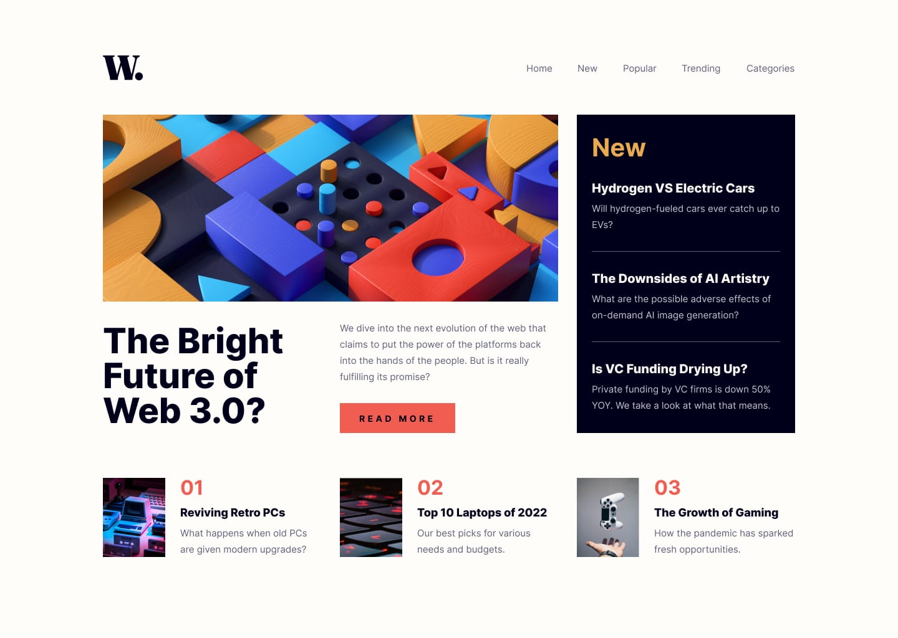
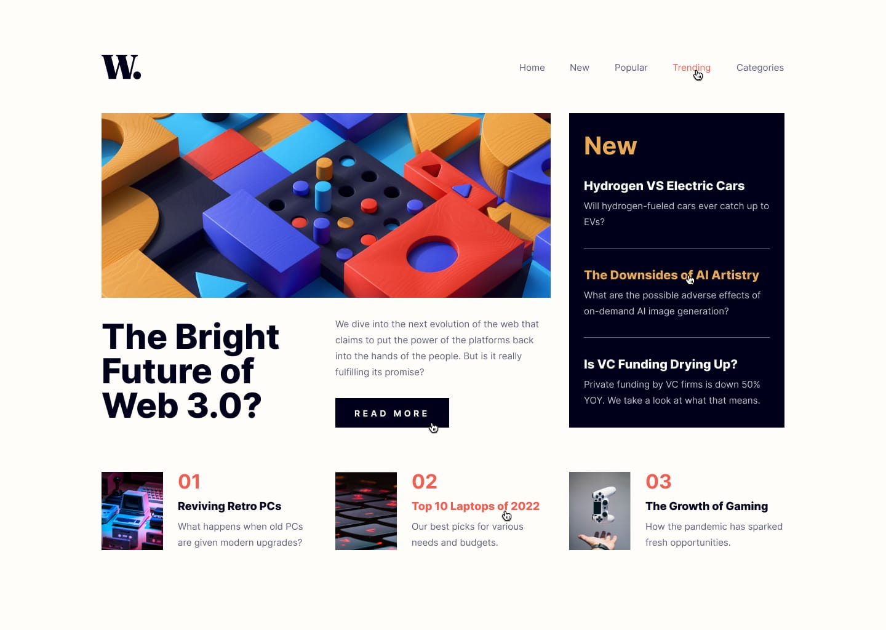
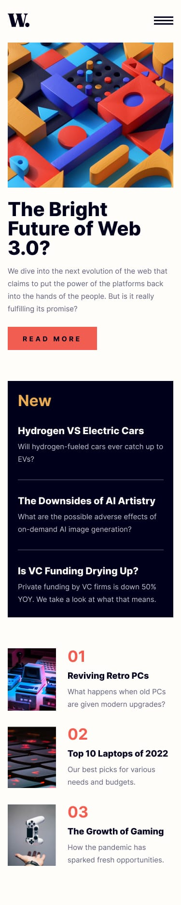
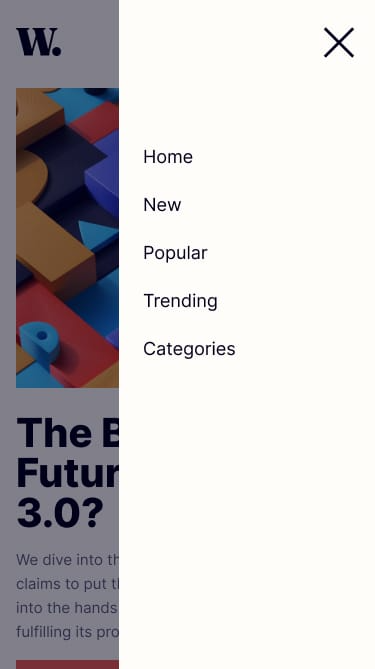

# 📰 News Homepage Clone

**Responsive News Homepage**  
Built with **React** and **JavaScript**

🔗 **Live Demo:** [News-Page-Clone on GitHub Pages](https://malikrob16.github.io/News-Page-Clone/)

---

## 📖 About the Project

**Newspage Clone** is a Frontend Mentor Junior level challenge. Link to challenge: https://www.frontendmentor.io/challenges/news-homepage-H6SWTa1MFl 
This is my first React based project. This challenge focus on frontend development skills like positioning, responsiveness, and base level javascript additions.
The site features a clean, user-friendly interface with both desktop and mobile responsiveness, and a visually appealing layout.

This project emphasizes **front-end development fundamentals** — layout, responsiveness, accessibility, and user experience.

---

## Design templates

-Desktop Design:


-Active states:


-Mobile Design:


-Mobile Menu Design:


---

## 🧩 Features

- 📽️ **Reusable React Components:** Structured UI built using modular components.  
- 💬 **Interactive UI:** Includes hover effects and dynamic content presentation.  
- 📱 **Responsive Design:** Optimized for desktop and mobile screens using CSS Flexbox.  
- ⚡ **Fast & Efficient:** SPA powered by React's virtual DOM.  

---

## 🛠️ Technologies Used

| Category | Tools & Languages |
|-----------|------------------|
| **Frontend** | React, JavaScript (ES6), JSX |
| **Styling** | CSS3 |
| **Version Control** | Git & GitHub |
| **Deployment** | GitHub Pages |

---

## 📅 Project Timeline

Duration: November 2025 – November 2025 (2 weeks)
Role: Front-End Developer
Author: Malik Robinson

---

## 📂 Project Structure
```
```bash
News-HomePage-Clone/
│
├── design/
│   ├── active-states.jpg     # Active-states (Desktop design)
│   ├── desktop-design.jpg    # Desktop-design
│   ├── mobile-design.jpg     # Mobile-design
│   └── mobile-menu.jpg       # Mobile-menu design
│
├── public/
│   ├── assets/        # Images, Icons, etc.
│       └── images/    # Images and icons
│   └── index.html     # HTML Template
│
├── src/
│   ├── components/          # Reusable UI components
│   ├── App.css              # Global styling
│   ├── App.js               # Root component
│   ├── index.css            # base index styling
│   └── index.js             # base index
│
├── .gitignore         # Git ignore file
├── package.json
└── README.md          # Project documentation
```

---

## 🧠 Learning Goals

The main objective of this project was to strengthen front-end development skills by:

-Practicing semantic HTML and modern CSS layout techniques

-Building responsive layouts with React-friendly styling

-Managing state using React Hooks (useState, useEffect, etc.)

-Improving modular code organization and reusability

-Building and deploying a production-ready React application

---

## 🧾 License

This project is open source and available under the MIT License
.

---

## 👨‍💻 Author

Malik Robinson
Front-End Developer | Passionate about creating interactive and responsive web experiences
📧 malik16.mr@gmail.com

---

## 🚀 Getting Started

### 1. Clone the repository
```bash
git clone https://github.com/Malikrob16/News-Page-Clone.git

### 2. Navigate into project directory
cd news-homepage-clone

### 3. Install dependencies
npm install
# or
yarn install

### 4. Run the development server
npm start
```
